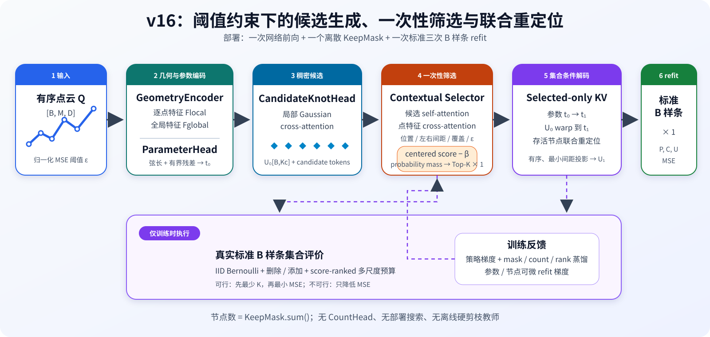

# v16：自适应候选节点选择与联合重定位

v16 的目标是：输入一条归一化有序点云，在给定 MSE 容差下，一次性预测尽可能少的三次 B 样条内部节点，并对保留节点和参数化进行联合调整。

部署只包含一次网络前向和一次标准 B 样条控制顶点最小二乘求解，不使用 CountHead、Hard-Concrete、BIC、逐次硬剪枝或部署时阈值扫描。



## 1. 节点数量的统一定义

本文所有 `K`、`Kc` 和 `--candidate-knots` 均表示内部节点数量。对三次开区间 B 样条，次数为 \(p=3\)，两端分别含四个重复端节点，因此：

\[
K_{\mathrm{full}}=K_{\mathrm{internal}}+2(p+1)=K_{\mathrm{internal}}+8,
\]

\[
N_{\mathrm{ctrl}}=K_{\mathrm{internal}}+p+1=K_{\mathrm{internal}}+4.
\]

| 配置写法 | 内部候选 `Kc` | 全保留时完整节点向量 | 全保留时控制顶点 |
|---|---:|---:|---:|
| `--full-knot-vector-size 64` | 56 | 64 | 60 |
| `--candidate-knots 64` | 64 | 72 | 68 |
| `--candidate-knots 96` | 96 | 104 | 100 |

`--candidate-knots 64` 不是“完整节点向量长度 64”。若使用完整节点向量记法，可以传入 `--full-knot-vector-size`；该参数与 `--candidate-knots` 互斥。

当前输入为 192 个点，代码要求 `Kc <= num_points - 4`。`--min-control-points 8 --max-control-points 24` 只控制合成源曲线，分别对应 4～20 个源内部节点，不会改变网络候选容量 `Kc`。

## 2. 为什么采用 Kc=64/96 两档

候选容量是高召回上限，不是最终节点数。最终节点数由 Selector 针对每条曲线独立决定。

对每个数据源 100 条验证曲线进行的方法中立容量诊断表明，在弦长参数、均匀内部节点、端点约束 float64 refit 和 MSE \(\le 2.5\times10^{-5}\) 下：

| 内部节点容量 | Synthetic | UJI | Natural Earth | USGS |
|---:|---:|---:|---:|---:|
| 56 | 100% | 100% | 82% | 72% |
| 64 | 100% | 100% | 88% | 76% |
| 80 | 100% | 100% | 91% | 86% |
| 96 | 100% | 100% | 93% | 96% |

该表只是均匀节点容量诊断，不是 v16 的正式结果。学习型候选能够调整参数和节点位置；已有 Kc=64 稠密 proposal 在 Natural Earth 和 USGS 上均达到过 92%，明显优于均匀节点结果。

推荐实验策略：

- `Kc=64`：轻量模型和容量消融基线；
- `Kc=96`：90% 工程通过率目标下的推荐主模型，给复杂真实曲线更大稠密可行性余量；
- `Kc=128`：仅用于追求更高稠密上限的附加消融，不作为默认配置；
- 不按数据集名称设置不同容量，防止测试信息泄漏。

从 64 增加到 96 会增加网络开销：候选对点特征的交叉注意力约为 \(O(K_cM)\)，Selector 的候选间注意力约为 \(O(K_c^2)\)。最终 refit 的规模只由实际保留节点数决定。因此应同时报告网络候选容量和最终平均节点数。

## 3. 部署数据流

输入：

- 有序点云 \(Q\in\mathbb R^{B\times M\times D}\)；
- 每条曲线的归一化 MSE 容差 \(\epsilon\)；
- 固定候选容量 \(K_c\)。

一次前向流程：

```text
Q [B,M,D]
  -> GeometryEncoder
       local [B,M,H], global [B,H]
  -> chord reference + ParameterHead
       strictly increasing t0 [B,M]
  -> CandidateKnotHead
       U0 [B,Kc], candidate tokens [B,Kc,H]
  -> contextual Selector
       raw importance s [B,Kc]
       curve-adaptive beta [B]
       probabilities p [B,Kc]
  -> probability-mass cardinality + one Top-K
       KeepMask [B,Kc]
  -> selected-only subset decoder
       t0 -> t1
       U0 warped into t1
       survivors jointly relocated
  -> Udeploy = U1[KeepMask]
  -> standard cubic B-spline refit x 1
       control points and fitted curve
```

### 3.1 GeometryEncoder 与 ParameterHead

GeometryEncoder 读取点坐标、归一化弦长以及一阶、二阶有限差分，输出逐点特征和全局曲线特征。ParameterHead 同时读取：

- `local_features`；
- `global_features`；
- 相邻点欧氏距离构造的弦长参考参数。

ParameterHead 预测弦长间隔的有界残差并重新归一化，得到严格递增的 \(t_0\in[0,1]\)。参数预测先于候选生成和筛选，并通过后续拟合损失联合更新。

### 3.2 CandidateKnotHead

CandidateKnotHead 使用 \(K_c+1\) 个 interval query。每个 query 带固定参数域锚点，对 `local_features + PE(t0)` 做局部 Gaussian cross-attention；相邻 interval token 融合为一个候选 token。

每个候选位置是均匀锚点加小于半个网格宽度的有界残差，因此：

- 候选从左到右具有稳定身份；
- 无需事后排序；
- 整个参数域始终得到覆盖；
- `Kc` 是候选上限，不是预测的最终节点数。

### 3.3 自适应 beta 与 mass-TopK

Selector 先进行候选间 self-attention，再对带参数位置编码的逐点几何特征做 cross-attention。KeepHead 为每个候选输出原始重要度 \(r_j\)。为避免候选重要度整体偏移与曲线级阈值互相抵消，先做曲线内中心化：

\[
s_j=r_j-\frac{1}{K_c}\sum_{i=1}^{K_c}r_i.
\]

自适应阈值头从候选池化特征、全局几何特征和容差特征预测每条曲线自己的 \(\beta\)：

\[
\ell_j=s_j-\beta,\qquad p_j=\sigma(\ell_j).
\]

\(\beta\) 越低，概率质量越大，模型倾向保留更多节点；\(\beta\) 越高，模型倾向使用更简单的表示。这里没有单独的 CountHead。

默认 `mass_topk` 根据概率质量和 Bernoulli 不确定性估计最终数量：

\[
\widehat K=
\operatorname{clamp}\left(
\left\lceil
\sum_jp_j+
\sigma_s\sqrt{\sum_jp_j(1-p_j)}+
\Delta K
\right\rceil,
K_{\min},K_c
\right).
\]

训练开始时的默认值为：

- \(\sigma_s=0.25\)，对应 `--one-shot-safety-sigma 0.25`；
- \(\Delta K=2\)，对应 `--one-shot-safety-knots 2`；
- \(K_{\min}=4\)，对应 `--min-selected-knots 4`；
- 参数域覆盖分区数为 4，对应 `--one-shot-coverage-bins 4`。

Joint 阶段的选择储备会从 `2 + 0.25 sigma` 逐步退火到
`0 + 0.05 sigma`，分别由 `--final-safety-knots 0`、
`--final-safety-sigma 0.05` 和 `--safety-anneal-epochs 10` 控制。
worst-source deployment pass 达到 `target + margin` 时全速退火，位于
target 到 `target + margin` 之间时以 0.5 倍速度继续简化；跌破 target 时
以 2 倍速度回滚、提高储备。因此正式 checkpoint 必须在最终储备下重新
验证，而不是把训练初期的保守数量当成部署结果。

随后只执行一次全局 Top-K。覆盖分区会在数量预算允许时优先给每个非空分区保留一个最高分候选，减少节点集中于局部区域的风险；空分区不产生 anchor，也不会因 `argmax` 的默认索引覆盖此前非空分区的有效 anchor。该过程没有 B 样条求解、阈值扫描或循环删除。

`--one-shot-selection-policy threshold` 仍保留为旧式消融，此时才使用 `p >= 0.5`。正式新实验应使用默认的 `mass_topk`。

### 3.4 KeepMask、参数更新和节点重定位

KeepMask 产生后，未选候选不能作为集合解码器的 Key/Value。存活 token 读取相邻存活节点间距、相对 rank 和存活数量：

1. 逐点 Query 对存活 token 做 attention，更新参数间隔 \(t_0\rightarrow t_1\)；
2. 候选节点按参数对应关系从 \(t_0\) 单调 warp 到 \(t_1\)；
3. survivor attention 联合预测保留节点位移；
4. 将存活间隔投影到满足最小间距的单纯形，保证节点位于 \((0,1)\) 且严格有序。

`--relocation-blend 0` 使重定位从身份映射开始，避免训练初期把存活节点强行拉向均匀 rank。删除、参数更新和剩余节点微调属于同一网络图，而不是从原候选位置直接取子集。

## 4. 训练流程

### 4.1 数据组成

默认合成数据是归一化开放三次 B 样条，控制顶点数为 8～24，对应源内部节点数 4～20。正式模式先在干净曲线上认证：完整源节点满足 MSE 阈值，且删除任意一个源节点后都以 20% RMS margin 违反阈值；通过后才加入观测噪声。因此这里的 source K 是固定参数化、源节点所有子集范围内的阈值最简复杂度，而不是随机生成 K。每个通过认证的 Synthetic 样本还返回真参数、带 mask 的真内部节点和真内部节点数，作为训练与验证标签。证明范围与限制见[合成曲线最简性报告](synthetic_data_minimality_report.md)。真实训练可混合：

- UJI Pen Characters v2；
- Natural Earth 10m coastline；
- USGS contours。

真实数据没有节点真值，不伪造节点标签；对应的真值有效 mask 为 false，因此只参与点重建、阈值可行性和在线组合监督。真实数据按 writer 或地理 group 划分 train/val/test，正式测试只能使用独立 test split。

`train-size` 表示每轮总抽样数。`real-fraction=0.5` 时约一半来自合成数据，另一半在三个真实来源间等概率抽样，避免 UJI 的规模压过地理数据。

### 4.2 Proposal 阶段

Proposal 阶段全保留 \(K_c\) 个候选，用可微标准 B 样条拟合训练 GeometryEncoder、ParameterHead 和 CandidateKnotHead。进入 Joint 阶段前，最佳 `.proposal.pt` 的每个数据源 dense pass 都必须达到 `--proposal-pass-target`。

Proposal checkpoint 按以下顺序选择：

1. 最大 worst-source dense pass；
2. 最小 overall dense MSE。

默认训练容差从 \([0.75\epsilon,1.0\epsilon]\) 对数均匀采样，避免使用比部署阈值更宽松的教师条件。

### 4.3 Joint 阶段

每条曲线在线评估有限的候选组合。当前核心教师是 **training-only 的粗到细、近似最小可行 ranked-prefix teacher**：先按 Selector 分数排序，并对每条曲线检查偏向低 K 的二次加密网格。默认 7 个区间、`Kc=96`、`Kmin=4` 时，网格约为 `4, 6, 12, 21, 34, 51, 72, 96`；certified Synthetic 还额外检查自己的真 K。随后只在首个粗网格可行边界内做批量二分，并对当前最佳前缀的 `K±2` 邻域及局部增、删、交换组合细化。这个教师复用部署的覆盖约束、KeepMask 条件解码和标准 B 样条 refit，但仅在训练中运行。

需要明确：节点重定位和参数更新会使“前缀长度—MSE”不严格单调，因此该搜索是有限预算内的近似教师，**不是全局最少节点的数学证明**。部署仍然只有一次 `mass_topk`、一次联合解码和一次最终 refit，不执行前缀搜索。

教师池还包含：

- 当前 `mass_topk` 部署组合；
- 独立 Bernoulli 样本，只用于 score-function 梯度；
- 基于当前排序的增加、删除反事实；
- 对所有曲线使用的低 K 二次加密前缀网格、certified Synthetic 的真 K
  引导点，以及搜索边界附近的排序 Top-K 预算；它们复用部署分区锚点；
- 全保留组合。

所有结构化教师组合都满足部署的最小节点数和覆盖规则，并经过同一个 KeepMask 条件解码器与标准 B 样条拟合。若存在可行组合，在线目标先选最少节点，再以 MSE 打破平局；若没有可行组合，只选择 MSE 最小者。原始 IID Bernoulli 样本只训练 score-function 项，不进入结构化教师池。

Joint 损失包括：

- 部署组合和在线最佳组合的标准 B 样条拟合损失；
- dense proposal 保持损失；
- Bernoulli score-function 损失；
- 对在线最佳组合的非对称 BCE，误删重要节点权重更高；
- 容量无关的对数计数损失：比较 `log1p(requested_count_score)` 与
  `log1p(teacher_count)`，不再除以 `Kc`，避免 Kc=96 时计数梯度被稀释；
- 对 certified Synthetic 的真计数损失：在部署尚不可行时只允许纠正
  under-count；部署可行后才对称地把 requested count 拉向
  `max(K_true-0.25,0)`，使后续 `ceil` 恰好落到 `K_true`；
- 对 certified Synthetic 的真计数过预测惩罚；仅对当前部署拟合可行的
  合成样本启用，避免为了贴近真计数而牺牲 MSE；
- 保留节点相对可删节点的排序损失；
- 面向困难曲线的上尾/CVaR式拟合项；
- 仅在拟合有安全余量时启用的复杂度项；
- 对 certified Synthetic 的真参数监督。位置比较前，proposal 节点按
  `proposal_params -> true_params`、部署节点按 `final_params -> true_params`
  做分段线性可微 warp；proposal 使用真节点到候选的定向覆盖损失；存活
  节点先在停梯度坐标上求一维单调、最大基数、最小 L1 的一一匹配，再对
  匹配坐标施加 SmoothL1。多出来或缺少的未匹配节点由真计数损失处理，
  避免 Chamfer 的多对一聚集。

复杂度权重不会在进入 Joint 后立即全开。这里实现的是
**validation-pass feedback complexity multiplier**，不是严格的
Lagrangian 或 primal-dual 求解：

- worst-source deployment pass 达到 `target + margin` 时全速上升，最高到
  `--complexity-max-scale 4`，并同步全速降低选择安全储备；
- 位于 target 与 `target + margin` 之间时以 0.5 倍速度继续简化，避免控制器
  永久停在训练初期的保守储备；
- 跌破 deployment target 时以 2 倍速度下降，并同步恢复安全储备；
- 默认 `margin=0.02`、`ramp=10`、`safety-anneal-epochs=10`，即 90%
  工程门槛对应 92% 的压缩启动安全线。

### 4.4 checkpoint 选择

Joint checkpoint 使用可行性优先规则。只有前缀教师、复杂度压力和安全储备
均完成规定的 Joint 成熟期后，checkpoint 才能进入正式简化排序：

1. 达到 deployment target 且简化课程成熟；
2. 在成熟可行 checkpoint 中，先偏好同时达到正式 count/F1/matched-MAE
   与 dense-pass 门槛的结果，再偏好达到 `target + safety margin` 的结果；
3. 正式质量与安全状态相同时，先按 0.25 节点宽度对 certified Synthetic 的计数 MAE
   分档；同档内先最大化 knot-match F1、最小化 matched knot MAE，再比较
   原始 count MAE；
4. 上述真值一致性接近时，再比较总体节点数、P95 MSE 和平均 MSE；
5. 简化课程尚未成熟时，优先提高 worst-source pass 和降低尾部误差，
   而不是提前减少节点。

若 `--output` 为 `outputs/checkpoints/example.pt`，训练产生：

```text
outputs/checkpoints/example.proposal.pt   最佳稠密候选模型
outputs/checkpoints/example.last.pt       最近状态，用于严格恢复训练
outputs/checkpoints/example.pt            最佳 Joint 模型
outputs/checkpoints/example.history.json  每轮训练和分数据源验证指标
```

旧 `candidate_selection_v16_fast90.pt` 来自固定 0.5 阈值架构，不能作为新 `adaptive beta + mass_topk` 的结果。不得直接 `--resume`；需要选择新输出并重新训练。`--init-checkpoint` 只迁移形状兼容的 encoder、ParameterHead 和 CandidateKnotHead 参数，Selector 和 subset decoder 重新初始化。

## 5. 推荐训练命令

下面的 PowerShell 公共参数使用当前默认的90%最差数据源工程门槛：

```powershell
$v16Common = @(
  '--epochs', '60',
  '--proposal-epochs', '20',
  '--train-size', '2400',
  '--val-size', '500',
  '--real-val-size', '100',
  '--batch-size', '16',
  '--num-points', '192',
  '--min-control-points', '8',
  '--max-control-points', '24',
  '--mse-tolerance', '2.5e-5',
  '--knot-match-tolerance', '0.01',
  '--certified-minimal-source',
  '--minimality-margin', '0.2',
  '--minimality-max-attempts', '16',
  '--minimality-audit-points', '512',
  '--oscillation-amplitude', '0.3',
  '--tolerance-factor-min', '0.75',
  '--tolerance-factor-max', '1.0',
  '--proposal-pass-target', '0.90',
  '--deployment-pass-target', '0.90',
  '--one-shot-selection-policy', 'mass_topk',
  '--one-shot-safety-sigma', '0.25',
  '--one-shot-safety-knots', '2',
  '--final-safety-sigma', '0.05',
  '--final-safety-knots', '0',
  '--safety-anneal-epochs', '10',
  '--one-shot-coverage-bins', '4',
  '--min-selected-knots', '4',
  '--relocation-blend', '0',
  '--teacher-prefix-search-steps', '7',
  '--count-weight', '2.0',
  '--supervised-count-weight', '1.0',
  '--supervised-over-count-weight', '1.0',
  '--true-parameter-weight', '0.1',
  '--proposal-knot-coverage-weight', '1.0',
  '--selected-knot-position-weight', '1.0',
  '--knot-position-beta', '0.01',
  '--complexity-weight', '0.05',
  '--complexity-ramp-epochs', '10',
  '--complexity-max-scale', '4.0',
  '--complexity-pass-margin', '0.02',
  '--real-fraction', '0.5',
  '--real-manifest', 'data/splits/uji_pen_v2.jsonl',
  '--real-manifest', 'data/processed/natural_earth/v5.1.2_10m_coastline/manifest.jsonl',
  '--real-manifest', 'data/processed/usgs_contours/large_scale/manifest.jsonl',
  '--device', 'cuda'
)
```

### 5.1 Kc=64 轻量/消融实验

```powershell
python scripts/train_v16.py @v16Common `
  --candidate-knots 64 `
  --output outputs/checkpoints/candidate_selection_v16_simplified_certified_k64.pt
```

### 5.2 Kc=96 推荐主实验

```powershell
python scripts/train_v16.py @v16Common `
  --candidate-knots 96 `
  --output outputs/checkpoints/candidate_selection_v16_simplified_certified_k96.pt
```

Kc=64/96 的正式容量消融应从相同初始化条件开始，并保持除 `candidate-knots` 和输出路径以外的参数完全一致。由于 Kc=64 旧 checkpoint 的候选 query 形状与 Kc=96 不同，不建议在容量消融中只给 Kc=64 完整 warm start；最清楚的协议是两者均从头训练。

若只做工程 warm start，可以在 Kc=96 命令中增加：

```powershell
--init-checkpoint outputs/checkpoints/candidate_selection_v16.proposal.pt
```

这只会复制形状兼容参数，新尺寸 query、Selector 和 subset decoder 仍会重新初始化；该运行不能与从头训练的 Kc=64 直接解释为纯容量消融。

## 6. 验证与点云部署

训练结束后先检查正式资格：

```powershell
python scripts/inspect_v16_checkpoint.py `
  --checkpoint outputs/checkpoints/candidate_selection_v16_simplified_certified_k96.pt `
  --required-pass-rate 0.90 `
  --mse-tolerance 2.5e-5
```

只有脚本返回 0 时才用于正式对比。返回 2 表示 checkpoint 仍只能作为诊断结果。除拒绝平均保留数等于候选容量的全保留退化解外，资格检查还要求：worst-source dense/deployment pass 均不低于 90%，Synthetic `count MAE<=2.0`、`knot-match F1@0.01>=0.60`、`matched-knot MAE<=0.005`，正式监督权重全部启用，最终固定安全节点为 0 且 safety sigma 不大于 0.05。

部署用户有序点云：

```powershell
python scripts/fit_v16_point_cloud.py `
  --checkpoint outputs/checkpoints/candidate_selection_v16_simplified_certified_k96.pt `
  --point-cloud data/my_curve.csv `
  --mse-tolerance 2.5e-5 `
  --output-dir outputs/fits/v16_certified_k96/my_curve
```

部署阶段执行：

1. 一次 GeometryEncoder、参数、候选、Selector 和联合重定位前向；
2. 一次 `mass_topk` 掩码构造；
3. 一次 CPU float64、端点约束、无正则标准 B 样条 refit；
4. 报告最终内部节点、完整节点向量、控制顶点、MSE 和耗时。

## 7. 公平论文对照协议

定量 benchmark 当前包含：

- Ours v16；
- Park & Lee, 2007 dominant-point adaptation；
- Liang et al., 2017 feature-IKI adaptation；
- Dung & Tjahjowidodo, 2017 serial adaptation；
- Kang, 2015 sparse ADMM adaptation；
- Luo et al., 2022 \(\ell_{\infty,1}\)+DE adaptation；
- Yeh, 2020 feature-CDF；
- uniform maximum-K greedy + gradient baseline。

这些均为依据公开方法描述实现的适配复现，不宣称与作者原始代码逐行一致。

主表必须统一：

- 相同归一化有序点云；
- 相同三次样条次数；
- 相同 MSE 定义和 \(2.5\times10^{-5}\) 阈值；
- 相同端点约束、无正则、CPU float64 最终 refit；
- 相同内部节点容量上限；
- 相同独立 test 样本；
- 失败样本保留在通过率分母中。

Kc=96 主实验的显式公平对比命令：

```powershell
python scripts/benchmark_v16_datasets.py `
  --checkpoint outputs/checkpoints/candidate_selection_v16_simplified_certified_k96.pt `
  --samples-per-knot-count 2 `
  --real-samples-per-dataset 20 `
  --mse-tolerance 2.5e-5 `
  --max-internal-knots 96 `
  --paper-initial-knots 96 `
  --liang-dense-knots 96 `
  --torch-num-threads 1 `
  --device cuda `
  --output-dir outputs/comparisons/v16_certified_k96_equal_capacity
```

若运行中断，在参数完全相同的情况下增加 `--resume`。不要为了让某一种方法更好而单独增大其容量。可另外建立“原论文推荐参数”附表，但不能与统一容量主表混为一谈。

耗时建议同时报告：

- Ours network-only 时间，用于说明一次性预测开销；
- Ours end-to-end 时间，包含最终 refit；
- 数值方法完整时间，包含参数化、节点求解/删除和最终 refit。

只拿 Ours network-only 与数值方法完整时间直接比较并不对称，必须在表头中明确时间边界。

真实数据没有真实节点向量，因此不能报告“与真值节点数差”。应报告最终节点数、输入点 MSE、原始高密度参考折线 MSE和通过率。合成数据才可以额外报告源节点数或 canonical reference。

benchmark 完成后，统一方法对比图由保存的逐样本结果重绘：

```powershell
python scripts/plot_v16_method_comparison.py `
  --input outputs/comparisons/v16_certified_k96_equal_capacity/comparison.json `
  --output-dir outputs/figures/v16_certified_k96_equal_capacity/method_comparison `
  --dpi 300
```

默认图包含 Ours、Park、Liang、Dung、Kang 和 Luo，并用 2×2 子图同时报告 MSE、通过率、最终内部节点数和完整方法时间。需要同时展示 Yeh 与统一贪心时增加 `--method-set all`。该脚本只接受 `benchmark_v16_datasets.py` 写出的完整、合格、同实验指纹 JSON，不运行方法，也不改动任何结果。

Ours 的留出真实曲线结构案例使用单独入口：

```powershell
python scripts/visualize_v16_ours_cases.py `
  --checkpoint outputs/checkpoints/candidate_selection_v16_simplified_certified_k96.pt `
  --real-samples-per-dataset 2 `
  --selection-seed 20260909 `
  --mse-tolerance 2.5e-5 `
  --max-internal-knots 96 `
  --device cuda `
  --dpi 300 `
  --output-dir outputs/figures/v16_certified_k96_equal_capacity/ours_cases
```

它为每个案例生成单图和一个 `ours_cases_overview.png`。单图明确绘制原始参考折线、网络输入采样点、最终拟合曲线、控制多边形、带索引控制顶点、曲线上的内部节点和参数域节点条；所有参数、完整节点向量和控制顶点坐标同时写入 `deployment_visualizations.json`。

`candidate_selection_v16_simplified_certified_k96.pt` 当前是必须重新训练并通过资格检查的目标权重路径。未产生合格主 `.pt` 前，上述命令不能被描述为已经生成正式结果；使用旧权重时必须显式添加 `--allow-unqualified-diagnostic`，其输出会被强制标记为 `DIAGNOSTIC NOT FINAL`。

## 8. 必须报告的指标

每个数据源分别报告，不能只给混合平均值：

- dense proposal pass rate；
- deployment pass rate；
- dense 与 deployment 的通过率差值；
- 平均 MSE 和 P95 MSE；
- 最终内部节点数均值及分布；
- Synthetic 真内部节点数均值、count MAE、count bias、exact rate 和
  within-one rate；
- Synthetic 参数 RMSE、knot-match precision/recall/F1 与 matched MAE；
- `sum(p)`、预测 \(\beta\) 和实际 Top-K 数量；
- all-knot 与 minimum-knot fraction；
- network-only 和 end-to-end 延迟；
- checkpoint 的 `Kc`、完整节点向量上限和控制顶点上限。

工程验收保持 worst-source deployment pass \(\ge90\%\)。复杂度压缩只在 worst-source pass \(\ge92\%\) 时逐步增强，以保留泛化安全余量。对于 source K=4～20 的 certified Synthetic，真计数均值约为 12；当前优化目标是让平均预测 K 落在 10～14，并尽量贴近逐样本真计数和真节点位置，而不是盲目追求更少节点。这是待重新训练验证的目标区间，不是代码修改后即可保证的结果。正式验收必须同时查看 MSE/pass、count MAE/bias 和 knot-match F1，不能只凭平均 K 宣称简化成功。

10～14 只适用于具有 K=4～20 真值合同的 Synthetic。真实曲线没有真节点数，
不能为了凑同一平均值而强制限为 14；它们仍由 MSE 约束、教师组合和复杂度
反馈决定所需节点数。

knot-match 验证先利用预测参数与真参数的单调对应关系，把最终节点 warp 到
真参数域，再按 `--knot-match-tolerance 0.01` 做一维一对一匹配；否则两个
不同参数化下的节点坐标不能直接解释为位置误差。

## 9. 代码入口

- [网络结构](../src/spline_fitting/models/v16_network.py)
- [在线反事实损失](../src/spline_fitting/losses/v16_subset_loss.py)
- [合成与真实混合数据](../src/spline_fitting/data/v16_mixed.py)
- [训练入口](../scripts/train_v16.py)
- [checkpoint 检查](../scripts/inspect_v16_checkpoint.py)
- [用户点云部署](../scripts/fit_v16_point_cloud.py)
- [多数据集对照](../scripts/benchmark_v16_datasets.py)
- [方法指标对比图](../scripts/plot_v16_method_comparison.py)
- [论文方法适配实现](../src/spline_fitting/evaluation/published_baselines.py)
- [Ours 拟合案例图](../scripts/visualize_v16_ours_cases.py)
- [真实曲线可视化](../scripts/visualize_v16_real_deployments.py)
- [论文方法复现边界](published_knot_methods_reproduction.md)
